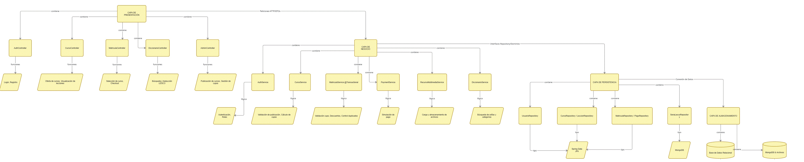
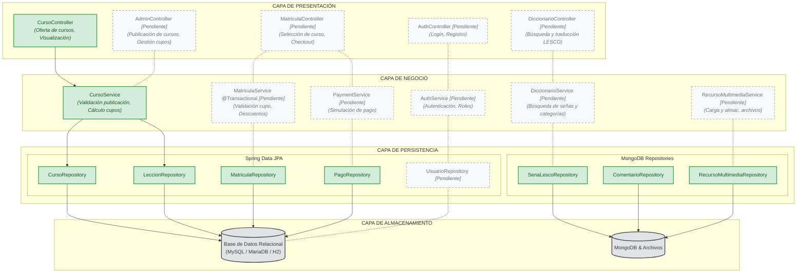

# Diagrama de Arquitectura del Sistema

## 1. Imagen del Diagrama (Versionada)

---

## 2. Diagrama de Arquitectura en Mermaid (Diffeable y Alineado al Estado Actual)

> **Convención de Estados:**
> - 🟩 **Verde / Borde Sólido (Entregado):** Componentes y flujos que ya se encuentran implementados en el código fuente.
> - ⬜ **Gris / Borde Punteado (Pendiente):** Componentes y flujos que forman parte de la visión de destino para iteraciones futuras.

---