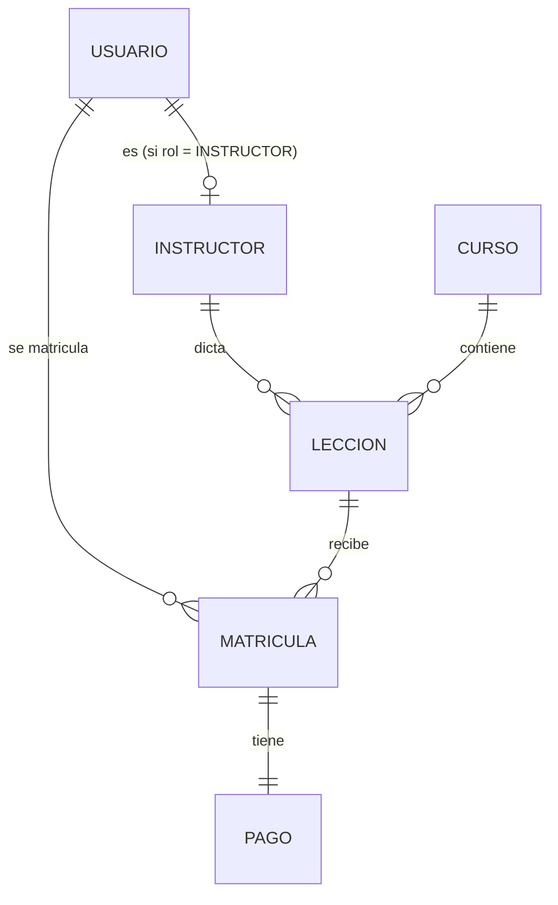

# Modelo de datos de LescoCR

Este documento explica el modelo de persistencia: qué hay en cada tabla/colección,
por qué el esquema relacional está en 3FN, qué regla de negocio protege cada restricción, qué consulta acelera cada índice, y para cada colección de MongoDB las tres preguntas de diseño que llevaron a incrustar o referenciar.

Ver también [ADR-001](adr/ADR-001-EleccionStack.md) (por qué PostgreSQL + MongoDB)
y la [Propuesta de dominio](Propuesta_de_Dominio.pdf) (entidades y procesos de
negocio originales).

# 1. Reparto de datos

| Motor | Qué guarda | Por qué |
|---|---|---|
| **PostgreSQL** | `usuario`, `instructor`, `curso`, `leccion`, `matricula`, `pago` | Datos con relaciones fijas, restricciones fuertes (cupo, unicidad, estados) y necesidad de transacciones (matrícula + pago deben quedar juntos o ninguno). |
| **MongoDB** | `sena_lesco`, `recursos_multimedia`, `comentarios` | Contenido de forma variable (multimedia, comentarios con hilos) y/o de crecimiento no acotado, donde el esquema flexible y la ausencia de joins encajan mejor que una tabla relacional. |

## 2. Modelo relacional (PostgreSQL)

### 2.1 Diagrama



`curso_id` en `matricula` no se dibuja como relación aparte: es un valor
derivado de `leccion.curso_id` (ver 2.3), no una decisión de modelado
independiente.

### 2.2 Tablas

- **`usuario`** — cuenta base del sistema (login). `rol` distingue
  ESTUDIANTE/INSTRUCTOR/ADMINISTRADOR, unificando en una sola tabla a los tres
  actores de la propuesta de dominio.
- **`instructor`** — subtipo de `usuario`: solo existen aquí los usuarios que
  pueden dictar lecciones. Comparte clave primaria con `usuario`
  (`usuario_id`), en vez de tener un id propio.
- **`curso`** — unidad matriculable (nombre, precio, cupo, fechas, si está
  publicado). No tiene instructor propio: cada lección tiene el suyo.
- **`leccion`** — contenido de un curso, con su instructor asignado y su
  posición (`orden`) dentro del curso.
- **`matricula`** — vincula a un estudiante con una lección (ver 2.3 sobre
  `curso_id`).
- **`pago`** — pago (simulado) de una matrícula, 1:1.

### 2.3 Por qué está en 3FN

Un esquema en 3FN no tiene columnas que dependan de otra cosa que no sea la
llave primaria de su propia tabla, ni datos derivables que se guarden por
duplicado "por si acaso". Puntos concretos de este esquema:

- **`cupo_disponible` no existe como columna.** Se calcula
  (`cupo_total - COUNT(matriculas activas)`, vía `leccion.curso_id` →
  `matricula.curso_id`) en el momento de la consulta. Guardarlo como columna
  sería un valor derivado que se desincroniza apenas se crea o cancela una
  matrícula.
- **`instructor` es un subtipo de `usuario`, no una copia de sus datos.**
  `instructor.usuario_id` es a la vez su llave primaria y su FK a `usuario`
  (mismo id, ninguna columna de `usuario` se repite en `instructor`).
- **`matricula.curso_id` es la única columna "derivada" que si se guarda**, y
  es una excepción deliberada y controlada, no una violación real de 3FN:
  Postgres no puede expresar un `UNIQUE`/`CHECK` que mire a través de un JOIN
  (`leccion.curso_id`), y la regla de negocio "un estudiante no puede
  matricularse dos veces en el mismo curso" es a nivel de curso aunque la
  matrícula se haga por lección. La columna existe solo para que ese índice
  único pueda existir, y el trigger `fn_matricula_set_curso_id` (V6) la
  recalcula siempre desde `leccion_id` — nunca la escribe la aplicación, así
  que no hay forma de que quede desincronizada (a diferencia de una
  denormalización manual, que sí sería una violación real de 3FN porque
  dependería de que el código de la aplicación la mantenga consistente).
- **`matricula.precio_final` no es una violación de 3FN.** No es una copia
  redundante de `curso.precio`: es un hecho histórico (cuánto pagó
  *esta* matrícula, con el descuento vigente *en ese momento*). Si el curso
  sube de precio después, las matrículas ya hechas no deben cambiar de precio
  retroactivamente.
- Ninguna tabla tiene grupos repetidos (p. ej. "instructor1, instructor2..." en
  una fila de `curso`): esas relaciones 1-a-muchos son tablas aparte
  (`leccion`, `matricula`), que es justamente lo que exige 3FN en vez de 1FN.

### 2.4 Restricciones y qué regla protegen

| Restricción | Tabla | Protege |
|---|---|---|
| `uq_usuario_identificacion`, `uq_usuario_correo` | `usuario` | Una cédula o un correo no puede pertenecer a dos cuentas (el correo es, además, la clave de login). |
| `ck_usuario_rol` | `usuario` | Solo existen los 3 roles del sistema (ESTUDIANTE/INSTRUCTOR/ADMINISTRADOR). |
| PK `instructor.usuario_id` + trigger `fn_instructor_validar_rol` | `instructor` | Un usuario es instructor a lo sumo una vez, y **solo** si su `rol` es INSTRUCTOR — con esto, `leccion.instructor_id` no puede apuntar a un estudiante o administrador aunque haya un bug en la aplicación. |
| `uq_curso_codigo_periodo` | `curso` | Proceso 2: no se permite publicar un curso duplicado en el mismo período. |
| `ck_curso_nivel` | `curso` | Solo se admiten los 3 niveles de la propuesta de dominio. |
| `ck_curso_cupo_positivo` | `curso` | Un curso sin cupo no tiene sentido y evita cupos negativos al restar matrículas activas. |
| `ck_curso_precio_no_negativo`, `ck_curso_descuento_rango` | `curso` | El precio final de una matrícula (Proceso 1) nunca puede calcularse en negativo ni con un descuento sin sentido (>100% o <0%). |
| `ck_curso_fechas` | `curso` | Proceso 2: la fecha de inicio debe ser anterior a la de fin. |
| `uq_leccion_curso_orden` | `leccion` | Dos lecciones del mismo curso no pueden compartir número de orden. |
| `ck_leccion_orden_positivo` | `leccion` | El orden es una posición (1, 2, 3...), no admite 0 ni negativos. |
| FK `leccion.curso_id ON DELETE CASCADE` | `leccion` | Si se elimina un curso, sus lecciones no quedan huérfanas. |
| FK `leccion.instructor_id → instructor(usuario_id)` | `leccion` | Solo un instructor real (ver fila de arriba) puede quedar asignado a una lección. |
| `uq_matricula_consecutivo` | `matricula` | El consecutivo es el folio público de la matrícula; no puede repetirse. |
| `ck_matricula_estado` | `matricula` | Solo los 3 estados del Proceso 1 (pendiente/activa/cancelada). |
| `ck_matricula_precio_no_negativo` | `matricula` | El precio final calculado (con descuento) nunca es negativo. |
| Trigger `fn_matricula_set_curso_id` | `matricula` | Mantiene `curso_id` siempre igual a `leccion.curso_id` (ver 2.3). |
| Índice único parcial `uq_matricula_usuario_curso_vigente` (`usuario_id, curso_id` WHERE `estado <> 'CANCELADA'`) | `matricula` | Proceso 1: un estudiante no puede tener dos matrículas vigentes en el mismo curso; cancelar libera el cupo para un nuevo intento. |
| `uq_pago_matricula` | `pago` | Relación 1:1: una matrícula tiene un único pago asociado. |
| `ck_pago_monto_no_negativo` | `pago` | El monto pagado nunca es negativo. |
| `ck_pago_metodo` | `pago` | Solo se aceptan los métodos de pago simulados soportados (sin pasarela real, según el alcance de la propuesta). |
| `ck_pago_estado` | `pago` | Solo los 3 estados del Proceso 1 (pendiente/aprobado/rechazado); la matrícula solo se activa cuando el pago queda `APROBADO`. |
| Trigger `fn_set_actualizado_en` | `pago` | Registra cuándo cambió de estado por última vez (p. ej. de PENDIENTE a APROBADO), sin depender de que la aplicación lo actualice a mano. |

### 2.5 Índices y qué consulta aceleran

(No se repiten aquí los índices que ya crea un `UNIQUE`/`PRIMARY KEY` de la
tabla anterior — esos ya sirven como índice de acceso.)

| Índice | Tabla | Consulta que acelera |
|---|---|---|
| `idx_curso_publicado` (parcial, `WHERE publicado = TRUE`) | `curso` | Catálogo público: solo lee cursos publicados; es la minoría mientras se arman, de ahí el índice parcial. |
| `idx_leccion_instructor` | `leccion` | Panel del instructor: "mis lecciones", sin recorrer todos los cursos. |
| `idx_matricula_curso_estado` (`curso_id, estado`) | `matricula` | Cálculo de cupos disponibles: contar matrículas `ACTIVA` agrupadas por curso. |
| `idx_matricula_usuario` | `matricula` | "Mis cursos" del estudiante. |
| `idx_matricula_leccion` | `matricula` | Roster de estudiantes matriculados en una lección (vista del instructor). |

## 3. Modelo documental (MongoDB)

Cada colección se creó con validador `$jsonSchema` e índices en
[`mongo-init/`](../mongo-init/). Para cada decisión de incrustar o
referenciar se responden las mismas tres preguntas: **cómo se lee el 90% del
tiempo**, **cuánto crece**, y **quién más lo necesita**.

### 3.1 `sena_lesco` — diccionario de señas

```json
{
  "palabra": "Hola", "palabraNormalizada": "hola",
  "categoria": { "codigo": "SALUDOS", "nombre": "Saludos" },
  "multimedia": [{ "tipo": "IMAGEN", "url": "...", "esPrincipal": true }],
  "tags": ["saludo"], "activo": true
}
```

**`categoria` embebida:**
1. *Lectura 90%:* siempre junto con la seña completa — el caso de uso es "mostrar
   la ficha de esta seña", nunca "dame solo la categoría sin la seña".
2. *Crecimiento:* casi nulo — un puñado de categorías (Saludos, Familia,
   Números...) que rara vez cambian de nombre.
3. *Quién más lo necesita:* nadie fuera del contexto de una seña; el proyecto no
   tiene una pantalla de "administrar categorías" independiente.
→ **Embeber.** Costo aceptado: renombrar una categoría exige un
`updateMany({ 'categoria.codigo': ... })` en vez de un solo `UPDATE`.

**`multimedia` embebida:**
1. *Lectura 90%:* siempre junto con la seña (mostrar la imagen/video es el
   propósito central del diccionario).
2. *Crecimiento:* acotado — 1 a 3 recursos por seña, no crece indefinidamente.
3. *Quién más lo necesita:* nadie; un recurso del diccionario no tiene sentido
   fuera de su seña.
→ **Embeber.**

Índices: `uq_palabra_normalizada` (único, evita duplicar el mismo término),
`idx_categoria_codigo` (navegar el diccionario por categoría), `ix_texto_busqueda`
(búsqueda libre por palabra/descripción/tags).

### 3.2 `recursos_multimedia` — videos/imágenes de lecciones

```json
{ "leccionId": 1, "cursoId": 1, "tipo": "VIDEO", "url": "...", "orden": 2,
  "metadata": { "duracionSegundos": 180 } }
```

**`leccionId`/`cursoId` referenciados** (apuntan a `leccion.id`/`curso.id` en
PostgreSQL):
1. *Lectura 90%:* "dame los recursos de esta lección" — pero eso no implica que
   deban vivir *dentro* del documento de la lección, porque la lección ni
   siquiera es un documento: vive como fila relacional en Postgres, que no
   puede alojar un array de objetos dentro de una fila.
2. *Crecimiento:* no acotado — un instructor puede subir recursos a una lección
   indefinidamente a lo largo del curso.
3. *Quién más lo necesita:* un panel administrativo puede necesitar "todos los
   recursos de este curso" (índice por `cursoId`) sin resolver primero cada
   lección en Postgres.
→ **Referenciar.** Importante: a diferencia de `matricula.curso_id` en
Postgres (mantenido por un trigger), aquí **no existe** nada que garantice que
`cursoId` coincide con `leccionId` — Mongo no puede ver las tablas de Postgres.
Mantener esa coincidencia es responsabilidad de la aplicación al crear el
recurso.

Índices: `idx_leccion_orden` (recursos de una lección, en orden — acceso
principal), `idx_curso` (vista administrativa por curso).

### 3.3 `comentarios` — comentarios de cursos

```json
{ "cursoId": 1, "usuarioId": 4, "autorNombre": "Luis Fernández Rojas",
  "texto": "...", "calificacion": 5, "creadoEn": "...",
  "respuestas": [{ "autorId": 2, "autorNombre": "...", "texto": "...", "creadoEn": "..." }] }
```

**`cursoId`/`usuarioId` referenciados:**
1. *Lectura 90%:* "dame los comentarios de este curso", paginados y ordenados
   por fecha — no requiere traer el curso completo.
2. *Crecimiento:* no acotado — un curso popular puede acumular cientos o miles
   de comentarios a lo largo de su vida. Embeberlos dentro de un documento de
   curso violaría el límite de 16MB por documento y el antipatrón de arreglos
   sin cota.
3. *Quién más lo necesita:* un panel de moderación por usuario (índice por
   `usuarioId`), independiente de la vista por curso.
→ **Referenciar.** `autorNombre` sí va embebido, pero como *snapshot* (copia
del nombre al momento de comentar), no como parte de esta decisión: es una
optimización de lectura que evita una consulta a Postgres por cada comentario
renderizado. Costo aceptado: si el usuario cambia de nombre, los comentarios
viejos muestran el nombre anterior.

**`respuestas` embebidas:**
1. *Lectura 90%:* siempre junto a su comentario padre — un hilo de respuestas no
   se consulta de forma aislada.
2. *Crecimiento:* acotado — un comentario de curso no acumula miles de
   respuestas (a diferencia de los comentarios del curso en sí).
3. *Quién más lo necesita:* nadie; una respuesta no tiene sentido fuera de su
   comentario.
→ **Embeber.**

Índices: `idx_curso_fecha` (`cursoId, creadoEn desc` — listar comentarios de un
curso, más recientes primero), `idx_usuario` ("mis comentarios"/moderación).
